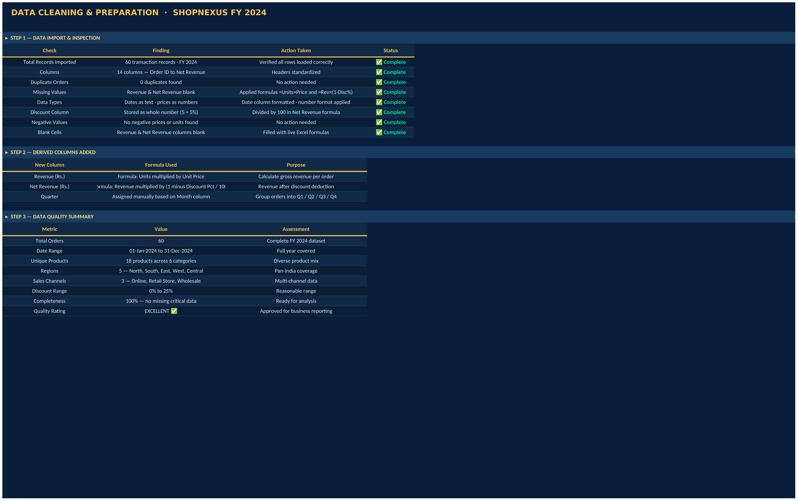
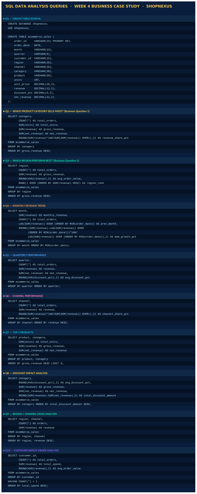
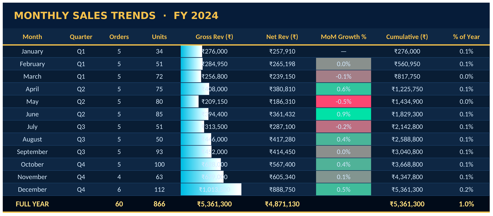

# Business-CaseStudy
End-to-End Business Case Study | Data Analytics
# ⚡ Week 4 — End-to-End Business Case Study
### Data Analytics Internship | Domain: AI & DATA
### Tools: Excel · SQL · Power BI Style Dashboard
### GitHub: https://github.com/Mohmedafroz/Week-4-Business-CaseStudy

---

## 🎯 Objective

Perform a complete end-to-end data analytics project on a
real-world E-Commerce dataset — covering data cleaning,
SQL analysis, business questions, dashboard building, and
a final insights report with strategic recommendations.

---

## 🛠 Tools and Techniques Used

Tool / Concept | Usage
--- | ---
Microsoft Excel | Primary tool for data, analysis and dashboard
SQL (MySQL) | 10 queries — CREATE, SELECT, GROUP BY, JOIN, RANK, LAG
SUMIF / COUNTIF | Category, region and channel aggregations
SUMIFS / COUNTIFS | Multi-condition cross analysis
AVERAGEIF / AVERAGEIFS | Discount and order value analysis
RANK | Product and region performance ranking
Conditional Formatting | Data bars and color scales for visual insight
AutoFilter | Interactive slicers on all data sheets
Line Chart | Monthly revenue trend
Bar Chart | Category, region and quarterly revenue
Pie Chart | Channel revenue distribution
KPI Cards | Gross Revenue, Net Revenue, Orders, Top Category, Best Region

---

## 📂 Sheets Overview

Sheet | Purpose
--- | ---
📈 Dashboard | 5 KPI cards + 6 live charts — no raw tables
🛒 E-Commerce Dataset | 60 transactions — 6 categories, 5 regions, 3 channels
🧹 Data Cleaning | 3-step cleaning log — inspection, derived columns, quality check
🏆 Product Analysis | BQ1 Answer — category ranking + top 10 products
🌍 Regional Analysis | BQ2 Answer — region ranking + region x channel cross table
📝 SQL Queries | 10 SQL queries — schema, analysis, business questions
📅 Monthly Trends | 12 months — MoM growth, cumulative revenue, % of year
📊 Quarterly Report | Q1 to Q4 — QoQ growth and avg discount
💡 Insights Report | Executive summary + 6 key findings + 6 recommendations

---

## 📊 Dashboard Preview

---

## 📸 All Sheet Screenshots

### 🛒 E-Commerce Dataset

### 🧹 Data Cleaning

### 🏆 Product Analysis — Business Question 1

### 🌍 Regional Analysis — Business Question 2

### 📝 SQL Queries

### 📅 Monthly Trends

### 📊 Quarterly Report

### 💡 Insights Report

---

## ❓ Business Questions Answered

### BQ1 — Which Product Sells Most?
Electronics is the number 1 category — contributing the
highest revenue driven by Laptop at Rs 58000 unit price,
Smart TV, and Smart Watch. Laptops alone appear in 9 orders
and generate the largest single product revenue across FY 2024.

### BQ2 — Which Region Performs Best?
South Region is the top performer — leading in both order
count and total revenue. It dominates Online and Wholesale
channels. North is a close second. Central region has the
lowest contribution and is an opportunity for growth.

---

## 🔑 SQL Queries Written

CREATE TABLE ecommerce_sales (
    order_id     VARCHAR(15) PRIMARY KEY,
    order_date   DATE,
    month        VARCHAR(15),
    quarter      VARCHAR(5),
    customer_id  VARCHAR(15),
    region       VARCHAR(20),
    channel      VARCHAR(20),
    category     VARCHAR(30),
    product      VARCHAR(50),
    units        INT,
    unit_price   DECIMAL(10,2),
    revenue      DECIMAL(12,2),
    discount_pct DECIMAL(5,2),
    net_revenue  DECIMAL(12,2)
);

-- BQ1: Which category sells most?
SELECT category, SUM(revenue) AS gross_revenue
FROM ecommerce_sales
GROUP BY category ORDER BY gross_revenue DESC;

-- BQ2: Which region performs best?
SELECT region, SUM(revenue) AS gross_revenue,
       RANK() OVER (ORDER BY SUM(revenue) DESC) AS region_rank
FROM ecommerce_sales
GROUP BY region ORDER BY gross_revenue DESC;

-- Monthly trend with MoM growth
SELECT month, SUM(revenue) AS monthly_revenue,
       LAG(SUM(revenue)) OVER (ORDER BY MIN(order_date)) AS prev_month,
       ROUND((SUM(revenue) - LAG(SUM(revenue)) OVER
             (ORDER BY MIN(order_date)))*100 /
             LAG(SUM(revenue)) OVER (ORDER BY MIN(order_date)),2) AS mom_growth_pct
FROM ecommerce_sales GROUP BY month ORDER BY MIN(order_date);

-- Channel performance
SELECT channel, COUNT(*) AS orders,
       SUM(revenue) AS revenue,
       ROUND(SUM(revenue)*100/SUM(SUM(revenue)) OVER(),2) AS share_pct
FROM ecommerce_sales GROUP BY channel ORDER BY revenue DESC;

---

## 💡 Key Business Insights

Insight | Finding
--- | ---
🏆 Top Category | Electronics — 51 percent of total revenue
🌍 Best Region | South — highest orders and revenue
📅 Best Month | December — peak festive season demand
📊 Best Quarter | Q4 — contributes 33 percent of annual revenue
📡 Top Channel | Online — 56 percent revenue share
💰 Discount Impact | Fashion carries up to 25 percent discount reducing net revenue

---

## 📌 Strategic Recommendations

R1 | Expand Electronics | Launch EMI options on Laptops and Smart TVs
R2 | Invest in South and North | Regional exclusive offers and same-day delivery
R3 | Fix April dip | Launch Summer Mega Sale campaign in April
R4 | Grow Online channel | Invest in digital ads to grow online revenue 15 percent YoY
R5 | Rationalize discounts | Cap Fashion discounts at 15 percent replace rest with loyalty points
R6 | Q4 preparedness | Pre-stock Laptops from August for Diwali and Christmas surge

---

## 📁 File Structure

Business-CaseStudy/
│
├── Week4_Business_CaseStudy.xlsx   ← Main Excel file
├── README.md                       ← This file
└── screenshots/
    ├── 01_Dashboard.png
    ├── 02_ECommerce_Dataset.png
    ├── 03_Data_Cleaning.png
    ├── 04_Product_Analysis.png
    ├── 05_Regional_Analysis.png
    ├── 06_SQL_Queries.png
    ├── 07_Monthly_Trends.png
    ├── 08_Quarterly_Report.png
    └── 09_Insights_Report.png

---

## 👨‍💻 Author

Mohammed Afroz
Data Analytics Intern
🐙 GitHub: https://github.com/Mohmedafroz
📁 Repository: https://github.com/Mohmedafroz/Business-CaseStudy

---

⭐ Star this repo if you found it helpful!
